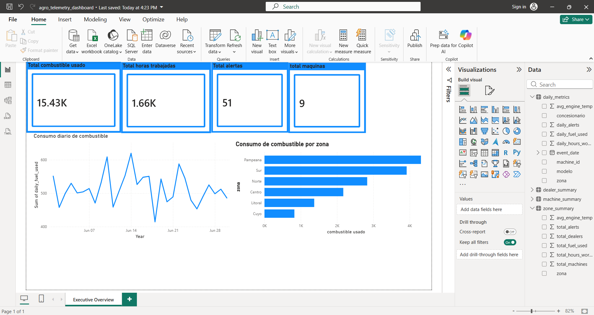

# Agro Telemetry BI Dashboard

Mini proyecto de Business Intelligence orientado al análisis de telemetría en el sector AgTech.

El objetivo del proyecto es simular datos de telemetría de máquinas agrícolas y transformarlos en métricas útiles para negocio usando Python, SQLite, SQL analítico, archivos CSV procesados y un dashboard ejecutivo en Power BI.

Este proyecto fue creado como práctica para una posición de **BI Developer Jr / Semi-Sr**, trabajando conceptos como SQL analítico, modelado de datos, métricas de negocio, dashboards, visualización de datos y flujo de trabajo con Git/GitHub.

---

## Estado del proyecto

El proyecto cuenta actualmente con dos etapas principales:

### Etapa 1 - Python, SQLite y SQL

En esta etapa se construyó el pipeline de datos:

* Generación de datos simulados de telemetría.
* Carga de datos en SQLite.
* Creación de tablas SQL.
* Consultas analíticas de negocio.
* Creación de vistas SQL.
* Exportación de archivos CSV procesados para herramientas BI.

### Etapa 2 - Power BI Dashboard

En esta etapa se desarrolló un dashboard ejecutivo en Power BI utilizando los CSV procesados de la Etapa 1.

El dashboard permite visualizar:

* Total de combustible usado.
* Total de horas trabajadas.
* Total de alertas operativas.
* Total de máquinas.
* Evolución diaria del consumo de combustible.
* Consumo de combustible por zona.
* Interactividad entre gráficos y KPIs.

---

## Objetivo del proyecto

El proyecto busca responder preguntas de negocio como:

* ¿Qué concesionarios tienen mayor uso de máquinas?
* ¿Qué zonas consumen más combustible?
* ¿Qué concesionarios generan más alertas operativas?
* ¿Qué máquinas tienen mayor carga operativa?
* ¿Qué zonas o concesionarios deberían recibir atención técnica o comercial primero?

La idea es simular un entorno AgTech con máquinas agrícolas, concesionarios, zonas y eventos de telemetría.

---

## Dataset

El proyecto utiliza datos simulados de telemetría de máquinas agrícolas.

### Modelos de máquinas

| Modelo             | Marca       | Potencia | Cilindrada |
| ------------------ | ----------- | -------: | ---------: |
| John Deere 6135J   | John Deere  |   135 HP |      6.8 L |
| New Holland TT4.90 | New Holland |    90 HP |      2.9 L |
| John Deere 8270R   | John Deere  |   270 HP |      9.0 L |

### Entidades del modelo de datos

El proyecto incluye:

* Modelos de máquinas
* Máquinas individuales
* Concesionarios
* Zonas
* Eventos de telemetría

---

## Tecnologías utilizadas

* Python
* SQLite
* SQL
* CSV
* Power BI
* Power Query
* Git / GitHub

---

## Estructura del proyecto

```text
agro-telemetry-bi-dashboard/
│
├── data/
│   ├── raw/
│   │   ├── machine_models.csv
│   │   ├── dealers.csv
│   │   ├── machines.csv
│   │   └── telemetry_events.csv
│   │
│   └── processed/
│       ├── dealer_summary.csv
│       ├── zone_summary.csv
│       ├── machine_summary.csv
│       └── daily_metrics.csv
│
├── db/
│   └── agro_telemetry.db
│
├── sql/
│   ├── 01_create_tables.sql
│   ├── 02_business_queries.sql
│   └── 03_create_views.sql
│
├── scripts/
│   ├── generate_telemetry.py
│   ├── load_sqlite.py
│   ├── run_sample_queries.py
│   ├── create_views.py
│   └── export_dashboard_csv.py
│
├── powerbi/
│   ├── agro_telemetry_dashboard.pbix
│   └── executive-overview.png
│
├── dashboards/
│   └── screenshots/
│
├── README.md
└── .gitignore
```

---

## Flujo de datos

El flujo actual del proyecto funciona de la siguiente manera:

```text
Datos CSV crudos
    ↓
Generación de telemetría con Python
    ↓
Base de datos SQLite
    ↓
Tablas y vistas SQL
    ↓
Exportaciones CSV procesadas
    ↓
Dashboard ejecutivo en Power BI
```

Este flujo simula una arquitectura simplificada de datos:

```text
Raw data → Modelo SQL → Datos procesados → Power BI Dashboard
```

En una versión futura con AWS, este mismo flujo podría representarse así:

```text
S3 → Glue Data Catalog → Athena SQL → QuickSight Dashboard
```

---

## Conceptos SQL practicados

El proyecto trabaja conceptos importantes para un rol BI:

* JOINs
* GROUP BY
* Agregaciones
* CTEs
* Window Functions
* Rankings
* Métricas de negocio
* Vistas listas para dashboard

---

## Métricas de negocio

El proyecto calcula métricas como:

* Uso total de máquinas por concesionario
* Consumo total de combustible por zona
* Alertas operativas por concesionario
* Temperatura promedio del motor
* Score operativo por concesionario
* Métricas diarias por máquina

Ejemplo de métrica:

```sql
ROUND(
    SUM(hours_worked) * 0.4 +
    SUM(fuel_used_liters) * 0.3 +
    total_alerts * 10,
    2
) AS operational_score
```

Este score ayuda a identificar qué concesionarios tienen mayor prioridad operativa.

---

## Dashboard Power BI

Se creó un dashboard ejecutivo en Power BI utilizando los archivos CSV procesados generados por el pipeline de Python y SQL.

El archivo principal del dashboard se encuentra en:

```text
powerbi/agro_telemetry_dashboard.pbix
```

### Vista Executive Overview

El dashboard incluye una vista ejecutiva con KPIs y gráficos principales:

* Total de combustible usado
* Total de horas trabajadas
* Total de alertas
* Total de máquinas
* Consumo diario de combustible
* Consumo de combustible por zona



---

## Cómo ejecutar el proyecto

### 1. Crear el entorno virtual

```bash
python -m venv venv
```

### 2. Activar el entorno virtual en Windows PowerShell

```bash
.\venv\Scripts\activate
```

### 3. Generar datos de telemetría

```bash
python scripts\generate_telemetry.py
```

### 4. Cargar los datos en SQLite

```bash
python scripts\load_sqlite.py
```

### 5. Ejecutar consultas de negocio

```bash
python scripts\run_sample_queries.py
```

### 6. Crear vistas SQL

```bash
python scripts\create_views.py
```

### 7. Exportar archivos CSV listos para dashboard

```bash
python scripts\export_dashboard_csv.py
```

---

## Archivos procesados

El proyecto genera archivos listos para usar en herramientas BI dentro de:

```text
data/processed/
```

Archivos generados:

* `dealer_summary.csv`
* `zone_summary.csv`
* `machine_summary.csv`
* `daily_metrics.csv`

Estos archivos pueden ser utilizados en:

* Power BI
* Metabase
* Looker Studio
* Amazon QuickSight

---

## Valor del proyecto

Este proyecto demuestra cómo transformar datos operativos de telemetría en información útil para la toma de decisiones.

No se enfoca solamente en la parte técnica, sino también en preguntas de negocio:

> Un dashboard es útil solamente si ayuda a alguien a tomar una mejor decisión.

El proyecto cubre un flujo BI completo:

```text
Python + SQL → CSV procesados → Power BI → Insights de negocio
```

---

## Relación con un rol BI Developer

Este proyecto practica habilidades importantes para un puesto BI Developer Jr / Semi-Sr:

* SQL analítico
* Modelado de datos
* Limpieza y preparación de datos
* Creación de métricas de negocio
* Generación de vistas para BI
* Exportación de datos procesados
* Creación de dashboard en Power BI
* Análisis visual de KPIs
* Pensamiento orientado a negocio
* Flujo de trabajo con Git/GitHub

---

## Versionado del proyecto

El proyecto fue organizado en ramas y tags para simular un flujo de trabajo profesional.

### Ramas principales

* `main`: versión estable del proyecto.
* `developer`: rama de desarrollo general.
* `etapa-1`: versión estable de la Etapa 1.
* `etapa-2-power-bi`: rama utilizada para desarrollar el dashboard en Power BI.

### Tags

* `v0.1.0-etapa-1`: versión estable con Python, SQLite, SQL y exportación de CSV.
* `v0.2.0-etapa-2-power-bi`: versión estable con dashboard ejecutivo en Power BI.

---

## Futuras mejoras

* Crear más páginas en Power BI:

  * Rendimiento por concesionario
  * Análisis por máquina
  * Alertas operativas
* Agregar medidas DAX personalizadas
* Mejorar diseño visual del dashboard
* Crear dashboard en Metabase
* Agregar almacenamiento en AWS S3
* Agregar catálogo con AWS Glue
* Consultar datos con Amazon Athena
* Crear dashboard en Amazon QuickSight
* Agregar modelos con dbt
* Agregar controles de calidad de datos
* Generar datasets más grandes
* Automatizar el pipeline completo
